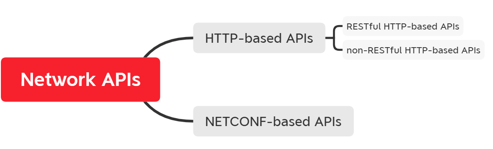

# 理解网络API

我们的重点是网络设备上最常见的两种类型的API，即基于HTTP的API和基于NETCONF的API。我们将从每一种类型的API的基础概念开始看起；一旦我们回顾了这些概念，我们就会使用具体的供应商实现的实践例子来探索这些API的消费。 

让我们从深入了解基于HTTP的RESTful API开始。

## 熟悉基于HTTP的APIs

在网络API的背景下，有两种类型的基于HTTP的API需要理解。它们是RESTful HTTP-based APIs和non-RESTFUL HTTP-based APIs。为了更好地理解它们以及RESTful一词的含义，我们将从研究RESTful API开始。一旦你理解了RESTful架构和原则，我们将继续前进，并将它们与non-RESTFUL HTTP-based APIs进行比较。

### 理解RESTful APIs

### 深入NETCONF

